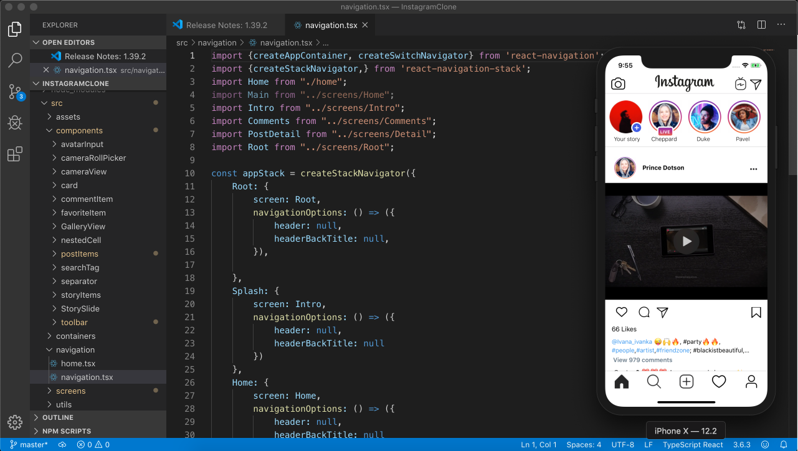
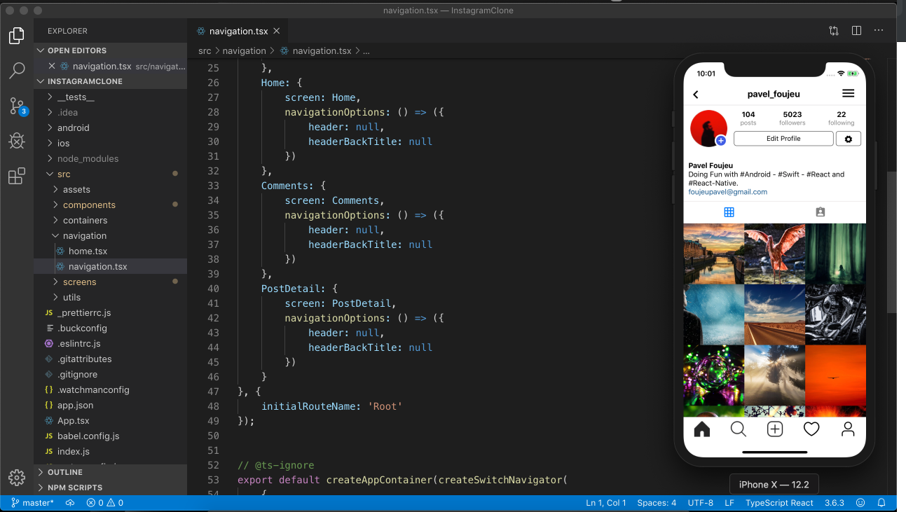
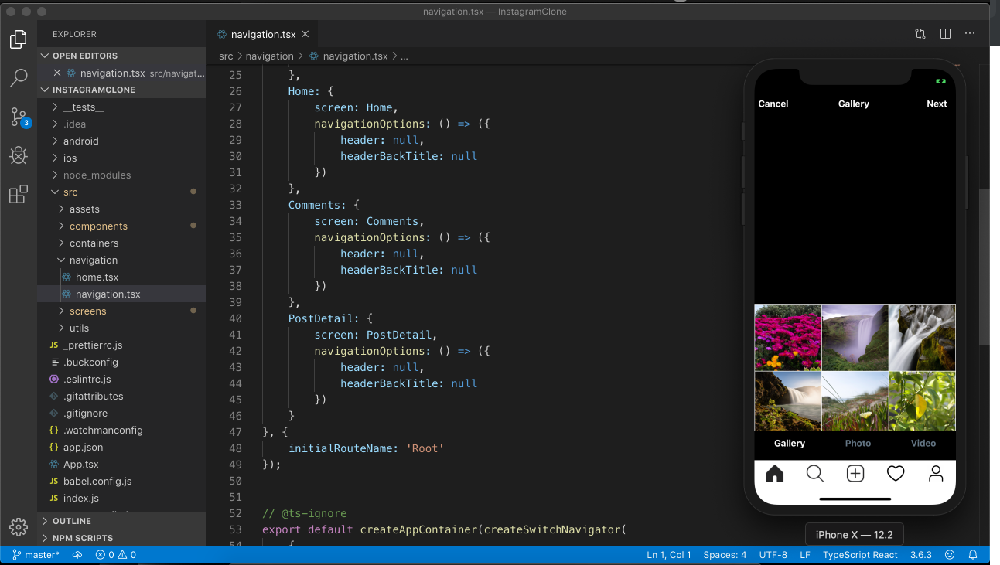
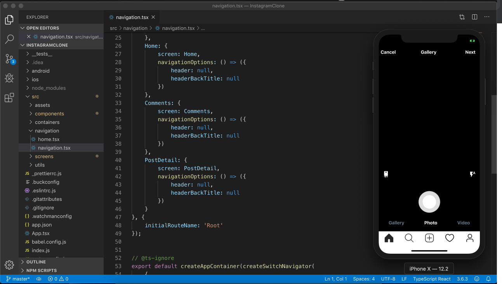
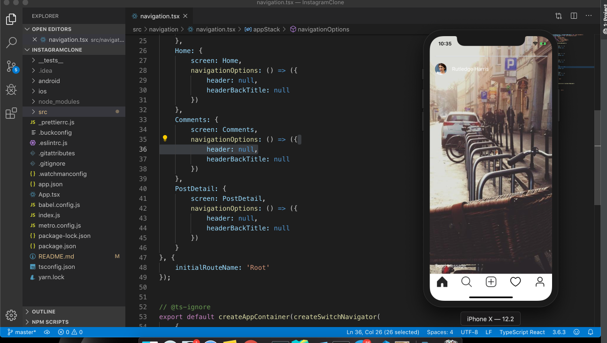
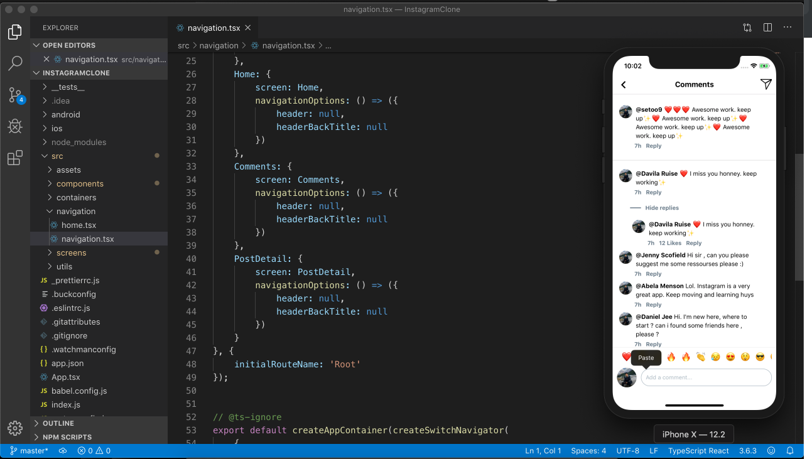
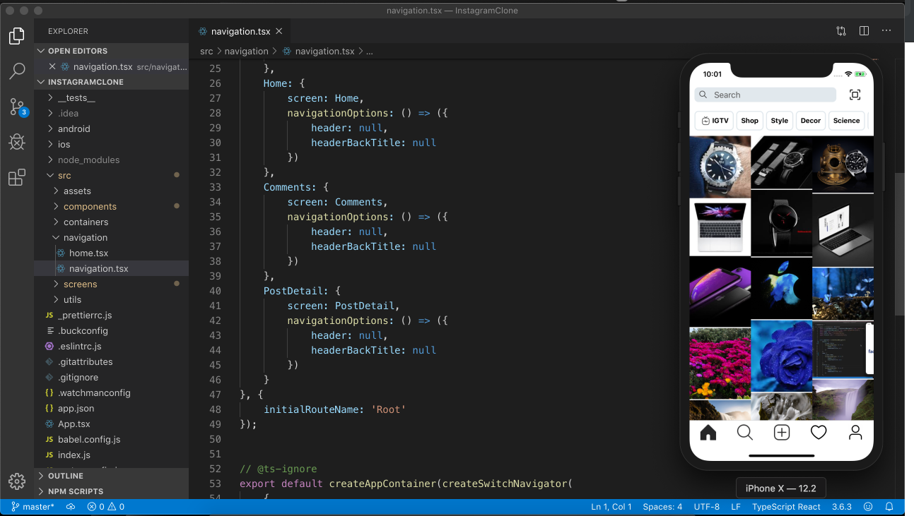
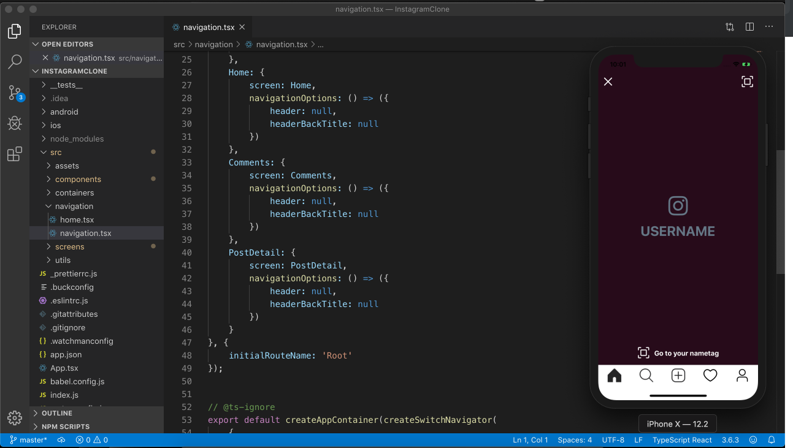

# InstagramClone
A clone of the Instagram app (October 2019) made with React, React-native and Typescript. 

##  Preview


##  Screen (Home)


##  Screen (Profile)


##  Screen  (Gallery)


##  Screen  (Camera)


##  Screen  (Story)



##  Screen  (Comments)



##  Screen  (Search By Tag)


##  Screen  (-#-)



### Dependencies

 - React Native (With Typescript)
 - Native Base
 - React Navigation
 - Others (See package.json at the root folder)
 
 ## Get Started
 
 #### 1. Clone the Repo
 
 On the command prompt run the following commands
 ```sh
 $ git clone https://github.com/Doha26/InstagramClone.git
 
 $ cd InstagramClone
 
 $ npm install
 
 $ react-native run-ios
 
 ```

## Author

*	[Pavel Foujeu](mailto:foujeupavel@gmail.com)

## Done with React-native

*	[Facebook challenge ](https://github.com/Doha26/Facebook-React-native)
